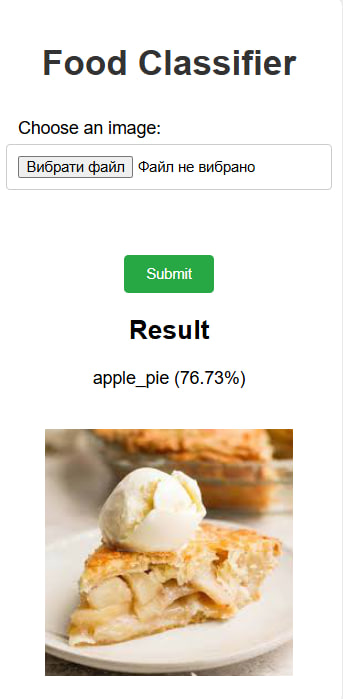
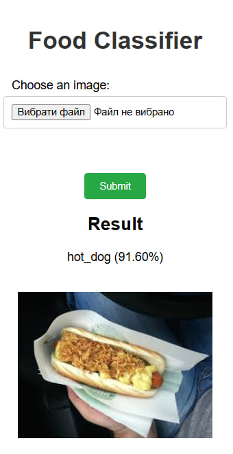
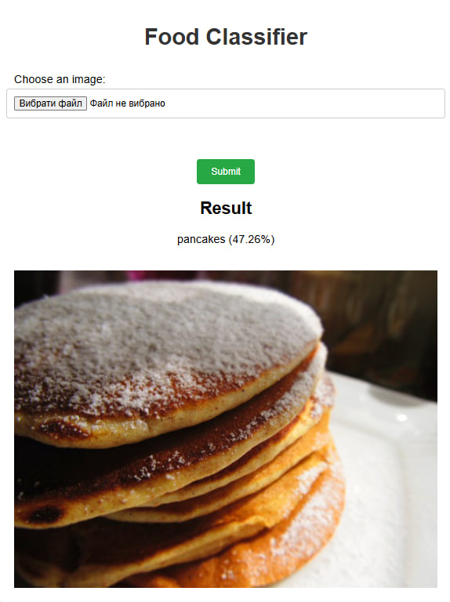
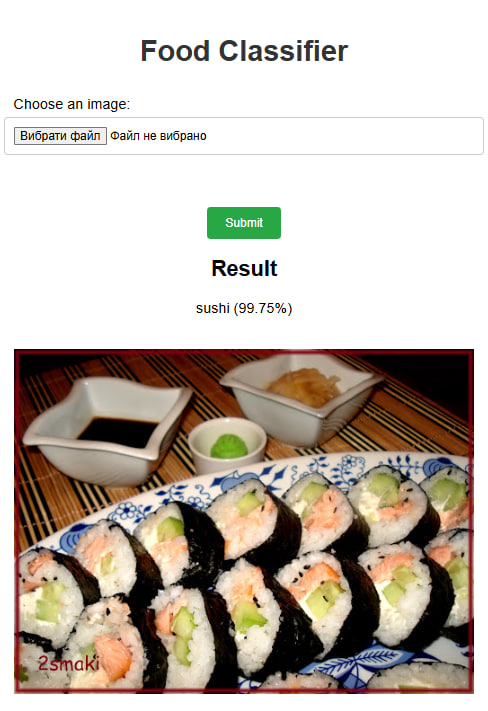

# Food Vision Big Classifier

This repository contains a project focused on developing a machine learning model for classifying types of food from photographs. The goal is to build a robust image classification system capable of accurately identifying different food categories based on visual features.

## Features

- Utilizes the Food-101 dataset, a comprehensive collection of food images sourced from Kaggle, comprising 101 distinct classes of food.
- Implements EfficientNetB0 and EfficientNetB1 architectures for feature extraction.
- Includes Convolutional Neural Networks (CNN) to build and train the model.
- Includes data preprocessing, augmentation, and mixed precision training for optimized performance.
- Provides model checkpoints and early stopping to save and restore the best model states.
- Evaluates model performance using confusion matrices and accuracy plots.

## Examples of model predictions

<p float="left">
    
    
    
    
</p>

## Run app on your local machine

1. Clone the repository:

```bash
git clone https://github.com/davydantoniuk/food-vision-big-classifier.git
```

2. Navigate to the project directory:

```bash
cd food-vision-big-classifier
```

3. Make virtual environment:

```bash
python -m venv venv
```

4. Activate virtual environment:

**Windows:**

```bash
venv\Scripts\activate
```

**macOS/Linux:**

```bash
source venv/bin/activate
```

5. Install the required packages:

```bash
pip install -r requirements.txt
```

6. Run the application:

```bash
python app.py
```
